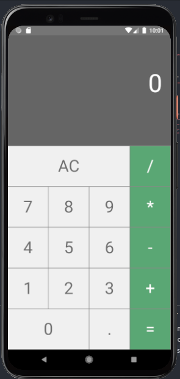

# Calculadora em React-Native

<p align="justify"> Projeto Calculadora, foi realizado como forma de treinamento e aprendizado da tecnologia React-Native no Curso - React Native: Desenvolva APPs Nativas para Android e iOS.

Conceitos aprendidos:

- Renderização
- Manipulação de Estilos
- Manipulação de Estados
- Aprimoramento de lógica em JavaScript 

O projeto atual, encontra-se com edições pessoais, estilização diferente do modelo apresentado no curso, afim de alcançar maior autonomia e adquirir mais conhecimentos. 

A aplicação ainda será atualizada durante o aprendizado.

## Futuras implementações:

- Background Personalizado
- Demais botões / operações

## Como rodar o projeto.

- 1. Clone o projeto com o comando.

```bash
git clone https://github.com/RuanSalles/calculadora-react-native.git
```

- 2. Navegue até a pasta do projeto e execute o comando

```bash
npx react-native start
emulate @versao do seu emulador ex: Pixel_5_API_27
```

- 3. Build o projeto na versão do seu emulador iOS ou Android

```bash
react-native run-android

react-native run-ios
```

## Versão Mobile





</p>
